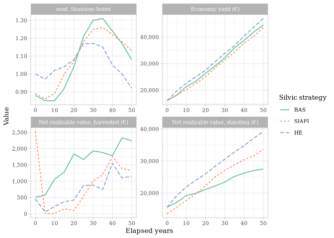
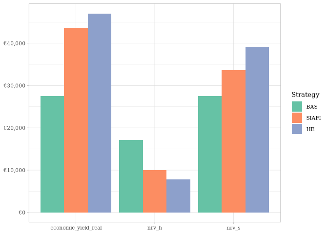

# test_import


## Prerequisites

``` r
library(tidyverse)
library(readr)
set_theme(theme_light())
update_theme(text = element_text(size   = 10,
                            family = "DejaVu Serif"))
```

## Import and tidy data

``` r
results_bas <-
    read_delim(
      "data/bas_results.txt", 
      delim = "\t", escape_double = FALSE,
      show_col_types = FALSE,
      trim_ws = TRUE
      )

results_siafi <- 
    read_delim(
      "data/siafi_results.txt", 
      delim = "\t", escape_double = FALSE, 
      show_col_types = FALSE,
      trim_ws = TRUE
      )

results_he <- 
    read_delim(
      "data/he_results.txt", 
      delim = "\t", escape_double = FALSE, 
      show_col_types = FALSE,
      trim_ws = TRUE
      )

results <- 
  bind_rows(
    list(
      bas   = results_bas,
      he    = results_he,
      siafi = results_siafi),
    .id = "strategy") |> 
  janitor::clean_names() |> 
  select(-bestand) |> 
  mutate(
    strategy = str_to_upper(strategy),
    strategy = fct_relevel(fct(strategy), "BAS", "SIAFI", "HE"))
```

## Merge and plot

``` r
parameters <- 
  c(
    g_wert_l    = "Economic yield (€)",
    wert_a      = "Net realizable value, harvested (€)",
    artprofil   = "mod. Shannon-Index",
    wert_v      = "Net realizable value, standing (€)"
  )

results |> 
  filter(baumart == "Alle Arten") |> 
  select(strategy, periode, baumart,
           wert_a, wert_v, g_wert_l, artprofil) |>
  mutate(
    g_wert_l = case_when(strategy == "bas" ~ wert_v,
                          TRUE ~ g_wert_l),
    periode  = (periode - 1) * 5) |> 
  pivot_longer(wert_a:artprofil,
               names_to  = "parameter",
               values_to = "value") |> 
  ggplot(aes(periode, value, linetype = strategy, color = strategy)) +
  geom_line(linewidth = .66) +
  labs(
    y        = "Value",
    x        = "Elapsed years",
    color    = "Silvic strategy",
    linetype = "Silvic strategy"
  ) +
  scale_color_discrete(palette = "set2") +
  scale_y_continuous(labels = scales::label_comma()) +
  facet_wrap(~parameter, scales = "free",
             labeller = labeller(parameter = parameters))
```



### Save plot for document

``` r
ggsave("~/Nextcloud/1_projects/Forest_Management_Group/images/plot_results.png",
       units = "mm",
       height = 210/2,
       width = (210 * (16/9))/2
       )
```

## Create an overview

``` r
overview <- 
  results |> 
    filter(baumart == "Alle Arten") |> 
    group_by(strategy) |> 
    summarise(
      nrv_h          = sum(wert_a),
      economic_yield = max(g_wert_l)
      ) |>
  # Reducing the economic yield of BAS strategy by 
  # the lost winnings from leaving the thinnings in the stand.
  mutate(economic_yield_real = if_else(strategy == "BAS",
                                       economic_yield - nrv_h,
                                       economic_yield
                                       ))

overview <- 
  results |> 
    filter(baumart == "Alle Arten") |> 
    slice_tail(n = 1, by = "strategy") |>
    select(strategy,
           nrv_s = wert_v,
           shannon_index = artprofil) |> 
    left_join(overview,
              by = "strategy") |> 
    relocate(nrv_h, nrv_s, economic_yield_real, shannon_index,
             .before = economic_yield)

overview
```

    # A tibble: 3 × 6
      strategy nrv_h nrv_s economic_yield_real shannon_index economic_yield
      <fct>    <dbl> <dbl>               <dbl>         <dbl>          <dbl>
    1 BAS      17096 27455               27456          1.08          44552
    2 HE        7836 39187               47023          0.92          47023
    3 SIAFI     9993 33655               43648          1.13          43648

### Plot the overview

``` r
overview |> 
  pivot_longer(-c(strategy, economic_yield, shannon_index), 
               names_to = "param",
               values_to = "value") |> 
  ggplot(aes(x = factor(param), y = value, fill = strategy)) +
  geom_col(position = "dodge") +
  scale_fill_discrete(palette = "set2") +
  scale_y_continuous(labels = scales::label_currency(prefix = "€")) +
  labs(x = NULL,
       y = NULL,
       fill = "Strategy")
```


